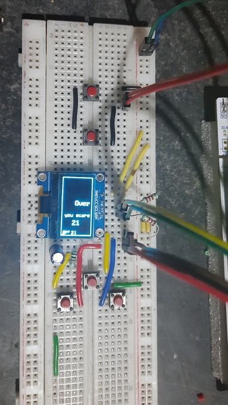

# Space War

It is a game written for learning purpose.
materials used:
1. stm32f767zi nucleo board
2. ssd1306 i2c display
3. switches, resistors, capacitor

It is written in rust using stm32f7xx-hal and embedded graphics crates, RTICC.
Example image: 

## Things learned

* i2c communication
* Real time operating systems
* timers,
* stm32f767 interrupts
* threading
* using random number generator
